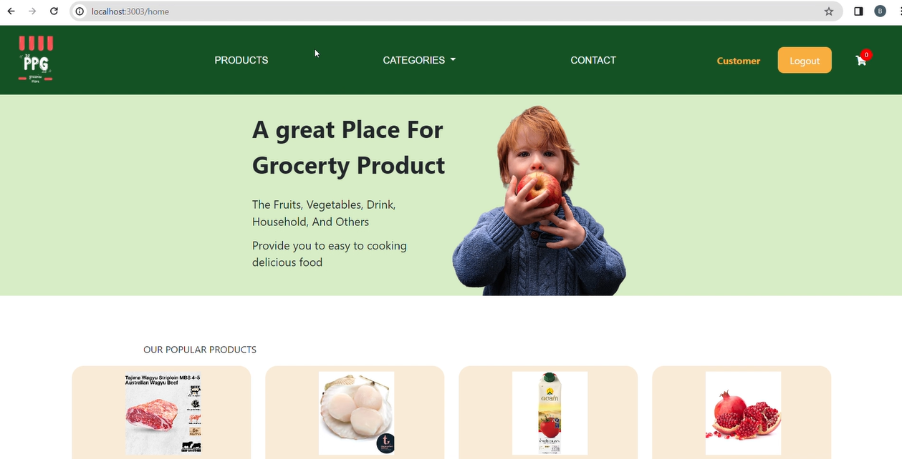
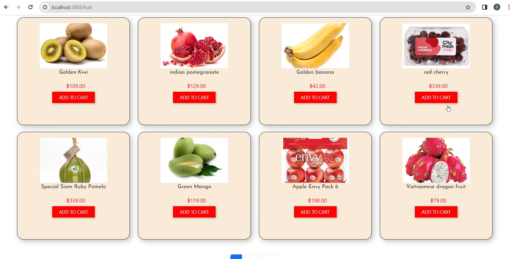
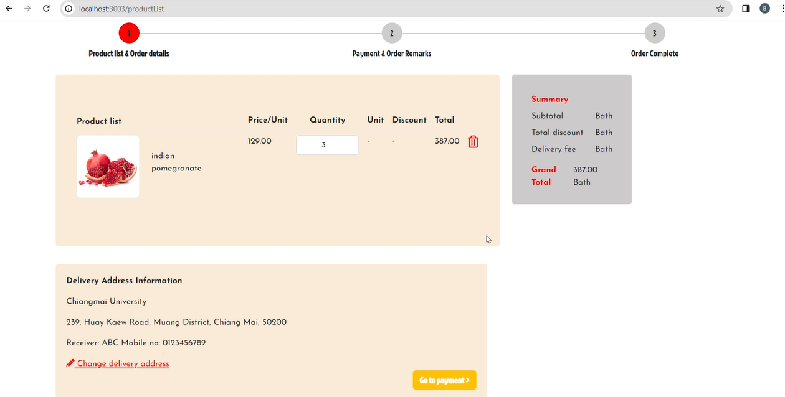
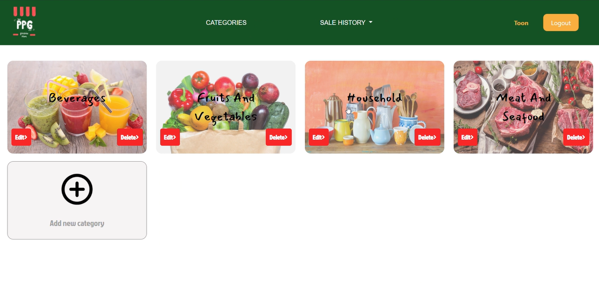

# 🛒PPG Grocery Store Website 
PPG Grocery Store is a full-stack web application created to meet the needs of users who want to buy general items online. Our platform provides a wide variety of product categories, making it easy for customers to browse, select, and purchase products at their convenience.

The system also includes a secure back-office for store owners to manage product categories, inventories, and track sales history — built with a user-friendly interface and solid backend architecture for smooth operation and scalability.

## 📸 Preview
<table>
  <tr>
    <td></td>
    <td></td>
  </tr>
  <tr>
    <td></td>
    <td></td>
  </tr>
</table>

## ✨ Features

- Authentication
- Category Management
- Product Management
- Sales History

## 🛠️ Framework and Tools

- Frontend: HTML, CSS, Bootstrap, JavaScript, EJS
- Backend: Node.js, Express.js
- Database: MySQL
- Auth: Session-based Authentication
- Deployment: AWS, Docker

## Name Group: PowerPuffGirl

- `652115016` Nichakorn Prompong - GitHub: [PlermNichakorn](https://github.com/PlermNichakorn)  
- `652115017` Nichapat Padung - GitHub: [ToonNich](https://github.com/ToonNich)  
- `652115025` Nonlanee Panjateerawit - GitHub: [BaiyorNonlanee](https://github.com/BaiyorNonlanee)  

